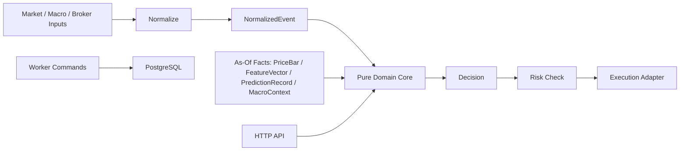

# Architecture

Market Intelligence Core is split into a pure domain layer and thin operational
layers around it. This keeps decision behavior testable and replayable.

## Stack

- Rust 2024 workspace.
- Axum and Tokio for HTTP.
- SQLx and PostgreSQL for append-only facts.
- Docker Compose or local PostgreSQL tools for migration verification.
- Minimal CI for format, lint, tests, and dependency audit.

## System Shape

## Boundaries

- `gm-domain` contains pure functions and serializable data types.
- `gm-integrations` defines provider traits and deterministic provider fixtures.
- `gm-api` converts HTTP requests into domain inputs and returns domain outputs.
- `gm-api` also performs optional audit persistence when `DATABASE_URL` is set.
- `gm-persistence` owns database connection, migration helpers, and append-only
  audit writes.
- `gm-worker` owns operational commands and future batch jobs.

## Invariants

- Scoring and decision functions do not call networks, providers, or databases.
- Scoring and decision functions do not read wall-clock time.
- Decision IDs are deterministic for the same event, facts, score, and action.
- Price is always an injected as-of fact.
- Derived facts are written upstream, then passed into the decision path.
- Database tables that represent facts are append-only by design.

## Minimal Runtime

Development requires Rust and Cargo. PostgreSQL is only required for migration
and persistence checks; the domain and API smoke tests can run without a
database.

When `DATABASE_URL` is configured for `gm-api`, startup applies migrations by
default. `POST /decide` then stores the normalized event, rule traces, decision,
and replay input snapshot. The domain crate remains database-free.

Provider adapters live outside the domain. They normalize external market,
filing, payment, event, entity, and broker surfaces into explicit inputs that
can be reviewed, persisted, and replayed.
