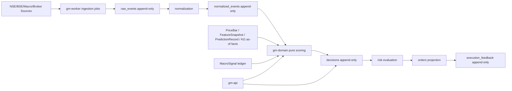

# Architecture

## Target Stack

- Rust 2024 workspace.
- Axum + Tokio for HTTP and async runtime.
- SQLx + PostgreSQL for append-only facts and derived projections.
- Redis for optional queue/cache coordination.
- Tower HTTP + tracing for request logging.
- Docker Compose for local Postgres/Redis.
- GitHub Actions for format, lint, tests, docs, security audit, and image build.

## System Shape

## Core Rule

The online decision path is pure. Network calls, stochastic calibration, entity extraction, ingestion, and broker communication happen upstream or downstream. Their outputs are persisted as immutable facts before decision fusion reads them.

## Crate Boundaries

- `gm-domain` has no database, HTTP, filesystem, environment, or clock dependency in scoring functions.
- `gm-api` translates HTTP JSON into domain inputs and returns domain outputs.
- `gm-persistence` owns SQL and migration interaction only.
- `gm-worker` owns long-running jobs and future scheduler/orchestration.

## Better Than The Original

- Price is an injected as-of fact, not a live call hidden inside `decide`.
- Quant features and prediction are typed domain contracts.
- Event-study calibration is a first-class pure module.
- CI treats formatting, linting, tests, docs, security, and image build as standard gates.
- Persistence starts with append-only table design instead of retrofitting invariants later.
